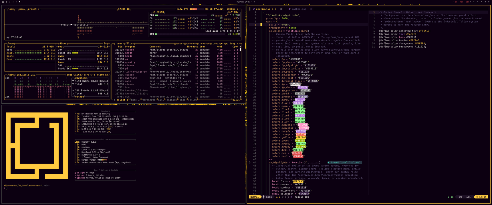
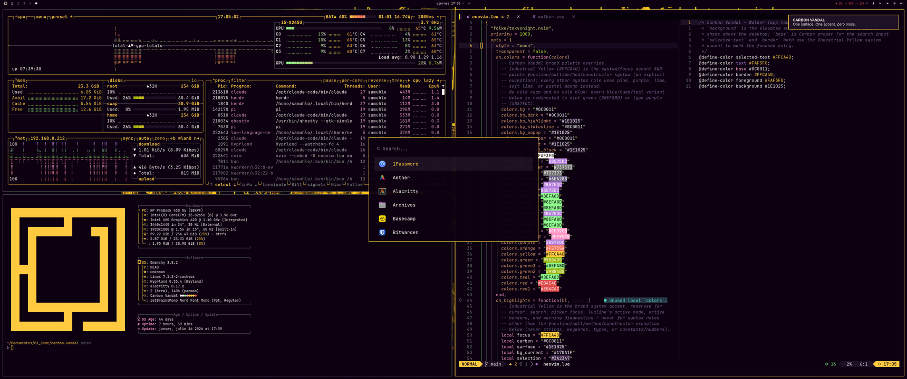
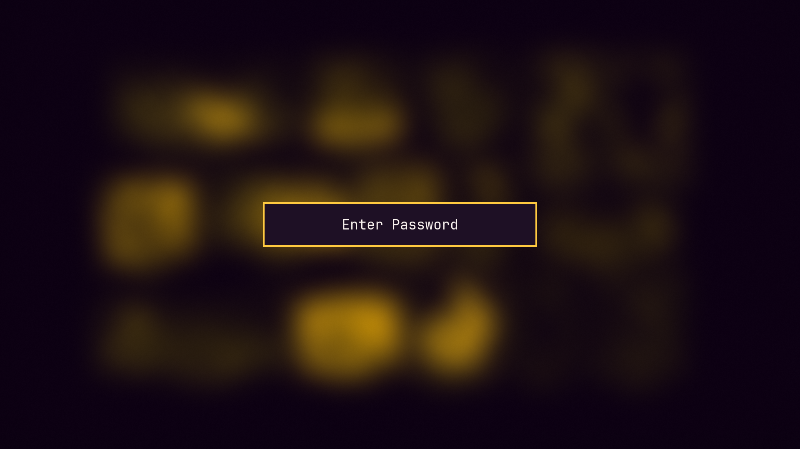

<div align="center">
  <br />
  <h1><code>./CARBON_VANDAL.sh</code></h1>

**ONE SURFACE. ONE ACCENT. ZERO NOISE.**
<br />

[](https://github.com/samuhlo/omarchy-carbon-vandal-theme)

[](LICENSE)

  <br />

  
  <sub><code>btop · fastfetch · neovim (LazyVim) — captured live on Hyprland, 3440x1440</code></sub>

  <br />
  <br />

  <table>
    <tr>
      <td width="50%">
        
        <div align="center"><sub><code>walker + mako — the accent only marks focus</code></sub></div>
      </td>
      <td width="50%">
        
        <div align="center"><sub><code>hyprlock — Carbon surface, Industrial Yellow frame</code></sub></div>
      </td>
    </tr>
  </table>

</div>

___

## // 00_ THE_MISSION

**Carbon Vandal** is a dark Omarchy theme. One surface — `Carbon #0C0011` —, one accent — `Industrial Yellow #FFCA40` —, and the text in `Concrete White #FAF3F0`. Terminals, bar, compositor, notifications, editor and system panel share the same palette, so the desktop reads like one piece, not a patch per app.

The theme ships this way to land faster: few decisions, executed with discipline. The rest arrives in later iterations.

> _note: when everything is the same color, the only signal that can mark focus is the accent. That is why `#FFCA40` does not decorate syntax — it is reserved. Any other use breaks the rule of the theme._

___

## // 01_ INSTALL

Omarchy installs the theme from the **repository root**. One URL, one command.

```bash
omarchy-theme-install https://github.com/samuhlo/omarchy-carbon-vandal-theme
```

If you work from a fork, swap the URL. The folder structure must stay exactly as it is — Omarchy reads the files directly from the root.

To do it from the UI:

1. Press `SUPER + ALT + SPACE`.
2. **Install** → **Style** → **Theme**.
3. Paste `https://github.com/samuhlo/omarchy-carbon-vandal-theme` and confirm with **Enter**.

___

## // 02_ THE_BLUEPRINT

| LAYER                | TECH                                                            | IMPLEMENTATION DETAIL                                                                 |
| :------------------- | :-------------------------------------------------------------- | :------------------------------------------------------------------------------------ |
| **Palette source**   | `colors.toml`                                                    | Canonical accent/foreground/background/ANSI palette. Omarchy reads it to auto-theme every app below that doesn't have its own file in this repo — foot, Helix, Obsidian, the `gum` CLI, the Hyprland screenshot share picker, and RGB keyboard lighting. |
| **Terminal**         | `alacritty.toml`, `kitty.conf`, `ghostty.conf`                  | Full palette including selection, vi-mode cursor, and search-match highlighting — no per-app overrides beyond the shared palette. |
| **Desktop / UI**     | `waybar.css`, `walker.css`, `mako.ini`, `swayosd.css`, `chromium.theme` | Flat Carbon background, single-accent highlights.                              |
| **Compositor / Lock**| `hyprland.conf`, `hyprlock.conf`                                | Carbon fills, Industrial Yellow on the focus ring (including grouped/tabbed windows).  |
| **Editor**           | `neovim.lua`                                                    | LazyVim + Tokyonight override: palette only, `#FFCA40` reserved for focus groups.     |
| **System**           | `btop.theme`, `icons.theme`                                     | `btop` recoloured to the palette; `icons.theme` stays `Yaru-magenta` for compatibility. |

Each static file in this repo takes priority over what `colors.toml` would generate automatically — Omarchy never overwrites a file the theme already ships. Static files exist here where Carbon Vandal needs more control than a straight palette substitution gives (terminal search-match colors, mako's action-button rules, kitty's tab/border slots); `colors.toml` covers everything else without needing a dedicated file per app.

LazyVim and Tokyonight are **preserved**: the override only applies the palette and limits `#FFCA40` to focus groups — cursor, search, picker, lualine in active mode, warnings, active border.

`icons.theme` points to `Yaru-magenta` for compatibility: renaming it to a fabricated theme can leave the bar without icons on systems that already load Yaru. This mirrors every stock Omarchy theme — none ship a custom icon set, they all point at an installed one.

> _note: LazyVim ships Tokyonight. Instead of replacing it, the override paints over its palette. Same plugin graph, fewer surprises._

___

## // 03_ PALETTE_PROTOCOL

| ROLE                                  | HEX         | FUNCTION                                            |
| :------------------------------------ | :---------- | :-------------------------------------------------- |
| Background (Carbon)                   | `#0C0011`   | Screen, terminals, base surfaces.                   |
| Elevated surface (Carbon Surface)     | `#1E1025`   | Floating panels, popovers.                          |
| Selection                             | `#FFCA40`   | Active highlight, text selection, terminal selection. |
| Base text (Concrete White)            | `#FAF3F0`   | All visible text.                                   |
| Invisibles / structure (Structure Gray)| `#737373`  | Comments, inactive dividers.                        |
| System accent (Industrial Yellow)     | `#FFCA40`   | Cursor, focus, search, active border, warnings.     |

> _note: `#FFCA40` is not a syntax color. Its job is to **signal focus**. If you see it decorating anything else, it is misapplied._

> _note: terminal ANSI green and ANSI blue slots in `alacritty.toml`, `kitty.conf` and `ghostty.conf` are intentionally remapped to `#FFCA40`. Omarchy startup logos, tmux selectors and several terminal UIs render focus through ANSI green/blue, so leaving those slots at the original olive/muted-purple hex makes the logo and selectors read green or purple instead of yellow. The bias is deliberate and limited to terminal palettes — desktop UI keeps the standard role separation._

___

## // 04_ EMPTY_ZONES

What ships and what doesn't, on purpose:

- **`preview.png`, `preview-unlock.png` and `unlock.png` are included.** The first two feed the in-app theme picker's thumbnails — both are real captures of a live session, not mockups. `unlock.png` is the brand mark Omarchy hands to Plymouth for the boot/disk-unlock screen (`omarchy-plymouth-set-by-theme`).
- **No `vscode.json`.** Every stock theme maps to a real, published VS Code marketplace extension with a matching palette. There is no such extension for Carbon Vandal yet, so VS Code/VSCodium/Cursor simply keep whatever theme they already have when Carbon Vandal is applied, instead of switching automatically.

___

## // 05_ WALLPAPERS

The theme ships one official wallpaper under `backgrounds/`:

- `bunny-delay-vandal.png` — rabbit / audio-effect sketch, sparse strokes on a soft surface, recoloured into the Carbon Vandal palette.

Omarchy picks it up automatically from the theme root, and sets it on install. Want more variety? See [omarchy-walls](https://github.com/samuhlo/omarchy-walls) under `// 06_ RELATED_PROJECTS` below.

___

## // 06_ RELATED_PROJECTS

Other tools by the same author, built in the same voice. Both are **separate, optional** — Carbon Vandal works fully on its own.

- **[omarchy-walls](https://github.com/samuhlo/omarchy-walls)** — a terminal wallpaper browser that streams 1,637 curated images into a floating window, live-previews them, and drops any pick straight into your active theme. No 3.7 GB clone required.

  ```bash
  # browse and install wallpapers without leaving the terminal
  omarchy-walls
  ```

- **[lazysubs-eye](https://github.com/samuhlo/lazysubs-eye)** — an AI subscription quota monitor for Omarchy: live usage windows for Claude Code, Codex and MiniMax in Waybar and an adaptive TUI, plus local token history.

___

## // 07_ EXTRAS

Carbon Vandal's palette also themes apps outside Omarchy's templating pipeline — they have no `.tpl` file, so `omarchy theme set` never touches them. These live under `extras/` as reference snippets to copy manually, not files Omarchy applies for you.

- **[extras/herdr.toml](extras/herdr.toml)** — the `[theme]`/`[theme.custom]` block for Herdr, a personal multi-agent terminal orchestrator (not yet published). Copy it into `~/.config/herdr/config.toml`.

___

<div align="center">
<br />

<code>DESIGNED & CODED BY <a href='https://github.com/samuhlo'>samuhlo</a></code>

<small>Lugo, Galicia</small>

  <br />
</div>